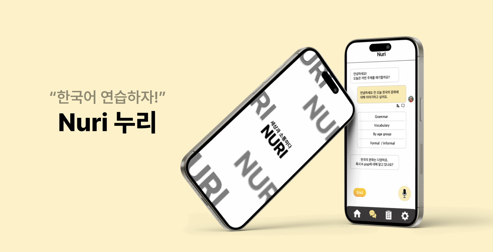
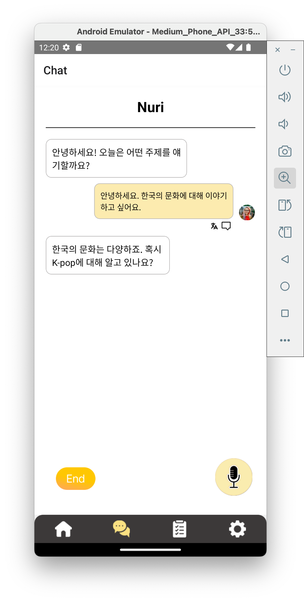
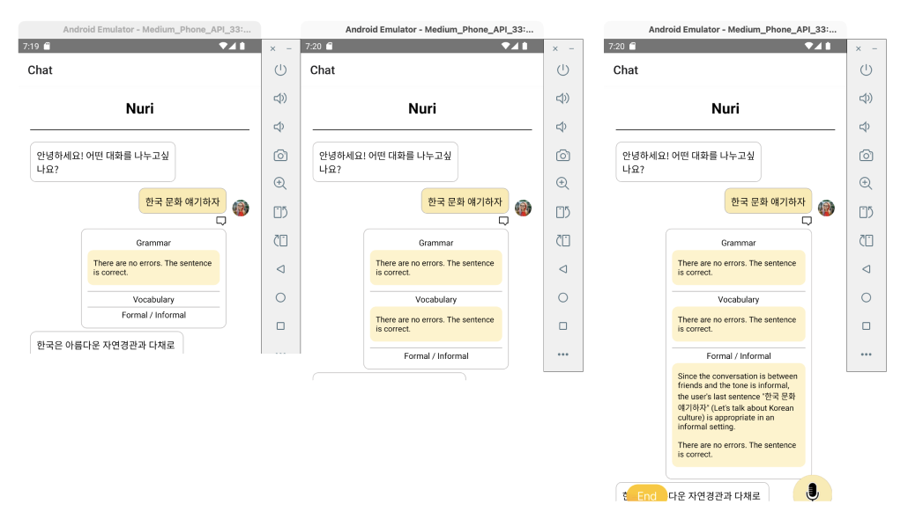
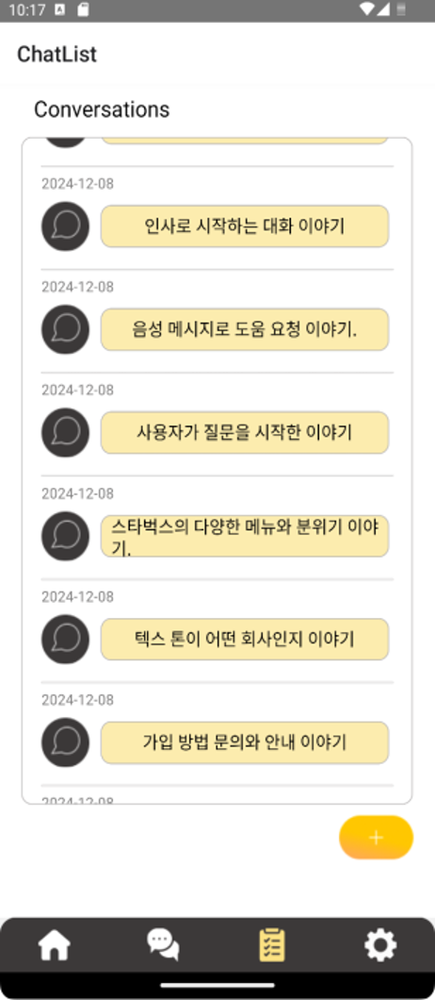
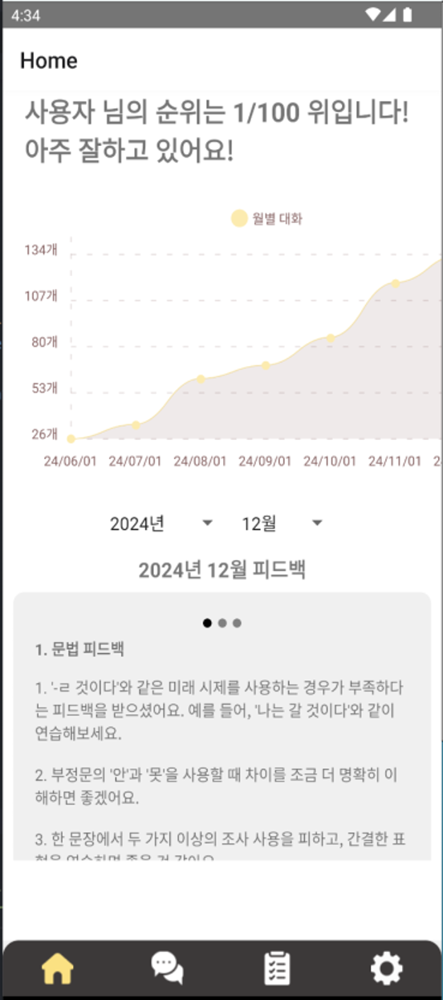
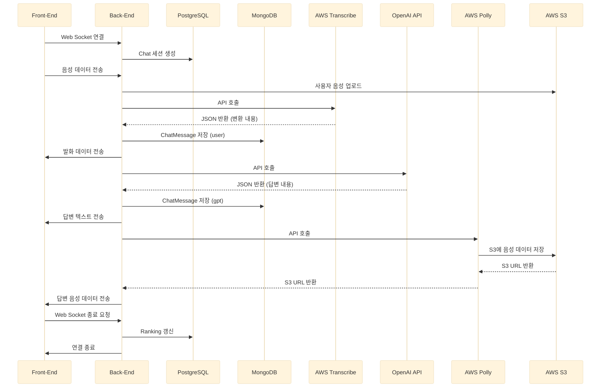

# Nuri

AI와의 음성 대화를 통해 한국어 회화를 연습하고, 문법·어휘·경어체(존댓말) 피드백을 받는 모바일 앱입니다.  
사용자는 음성으로 대화를 나누고, 대화 내용은 텍스트로 기록되며, 문법/어휘/경어체 관점의 피드백과 월별 대화 통계를 제공받습니다.

[Frontend Repo](https://github.com/vvzvvv/Nuri_frontend) | [Backend Repo](https://github.com/vvzvvv/Nuri_backend)

## Features

### 🎙️ 음성 대화
> 녹음한 음성을 STT로 변환해 AI와 대화, 응답은 TTS로 음성 재생

### 👩🏻‍🏫 회화 피드백
> 문법 / 어휘 / 경어체(존댓말) 관점의 피드백 제공

### 💬 채팅 기록
> 대화 목록 및 히스토리 조회

### 🏠 홈 피드 (통계)
> 월별 대화 수, 대화 수 랭킹

## Tech Stack

**Backend**

**Frontend**

## Architecture

### 대화 처리 시퀀스

